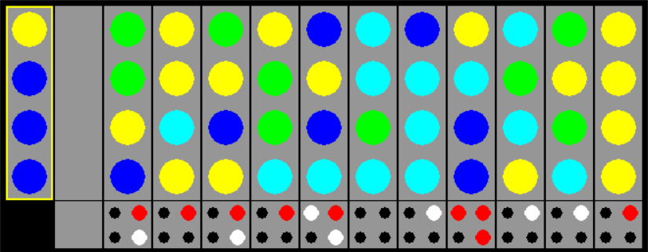

# gym-mastermind

An OpenAI gym environment for the Mastermind game. This is a forked project from https://github.com/jefio/gym-mastermind implementation.

You can find more information on the mastermind game here: https://en.wikipedia.org/wiki/Mastermind_(board_game)


# Installation

```bash
git clone https://github.com/fedingo/gym-mastermind.git
cd gym-mastermind
pip install -e .
```
## Use gym-mastermind

After installation, you can use this environment as any other from OpenAI gym. To make an environment make sure to `import gym_mastermind`

This is a snippet example on how to run the envirnoment:

```python
	import gym
	import gym_mastermind

	env = gym.make('Mastermind-v0')
	_ = env.reset()

	for _ in range(200):
		_, _, done, _ = env.step(env.action_space.sample())
		env.render()

		if done:
			_ = env.reset()
```

You can find a testing script in `env_test.py`


## Game Implementation

The environment is a simple implementation of the game, where there are 8 different colors available and 12 possible tries to guess the randomly sampled code. There is also the possibility to render the environment with a basic visualization of the game.



## Action Space
The game receives a 4-D vector of integer values between 0-7. This represent the current guess of the "hidden code"

## Observation Space
The game returns after each action a vector of size 8. The first 4 numbers are the combination just tried by the player, and the second 4 numbers are the result of the try, coded like:
- each 2 means that one of the tried elements is the right number in the right place
- each 1 means that one element is the right number, but that it is placed in the wrong spot
- otherwise 0s are for each wrong element in the tried combination
